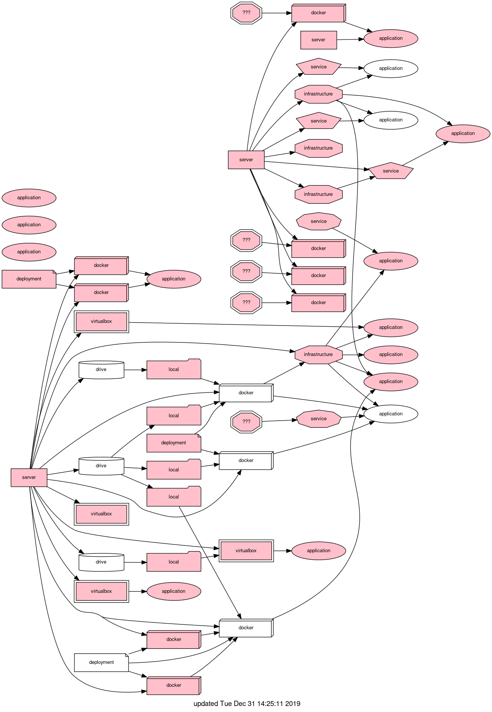

# IT Assets

Code to validate and graphically map a database of IT assets.

The database is simply a collection of YAML files describing assets.  Asset
types include `application/external`, `cloud/service`, `container/docker`,
`resource/deployment`, `physical/server`, `backup` etc.  Relationships are
validated, for example `container/docker` should define a dependency on an
asset of type `resource/deployment`, typically linking to the Dockerfile and
other resources needed to create the image.  Similarly a `storage/local` asset
should define dependencies on `drive` and `backup` assets.

Nodes below have their regular names replaced with the name of their type for
illustration, node names are more usually "Geoserver for bicycle app." etc.



Colors indicate validation failures or the presence of a `needs_work` tag.
Hovering over a node display attributes and validation issues.  Clicking on a
node opens a page reporting asset details, where links to external resources
are active.  Nodes and report pages include
`itas:///path/to/file.yaml#con_asset_id` links which can be used to [link your
favorite editor to the web view](#open-asset-definition-in-editor-from-browser).

An asset definition looks like:
```yaml
id: con_geoserver_bike
name: Bicycle app. GeoServer
description: GeoServer docker container for cycling app.
owner: Terry Brown <terrynbrown@gmail.com>
location: https://github.com/tbnorth/itassets
type: container/docker
depends_on:
 - srv_bigbox2 the server the container's running on
 - psvc_bb_apache /etc/apache/sites-enabled/010-bike_app
 - dply_geoserv_bike a link to the Dockerfile / compose / deploy repo. to make container
 - sto_store1_usr1 a link to a local storage definition
tags:
 - needs_work
 - archived
 - migrate_to_cloud
notes:
 - check with Alexis if this is still needed
open_issues:
 - separate defs from main code https://github.com/tbnorth/itassets/issues/1
closed_issues:
 - some other issue https://github.com/tbnorth/itassets/issues/11
 - etc. etc. https://github.com/tbnorth/itassets/issues/111
```
The first word (`srv_bigbox2` etc.) in the `depends_on` list is the linking ID
field, the remainder of the line is additional information.

## Running in a Docker container

```shell
docker run -it --rm \
  -v /some/path/to/assets:/inputs \
  -v /some/path/to/outputs:/outputs \
  tbnorth/itassets:latest
```
will read all the `.yaml` files in `/some/path/to/assets` and write outputs to
`/some/path/to/outputs`.

## Running from the command line

`itassets` requires [pyyaml](https://pyyaml.org/wiki/PyYAMLDocumentation) and
[graphviz - dot](https://www.graphviz.org/).  An example command line
invocation:
```shell
python3 itassets.py --assets ./some/path/*.yaml
# creates assets.dot and asset_reports folder
dot -Tpng -oassets.png -Tcmapx -oassets.map assets.dot
# creates assets.png and assets.map
cat docker/head.html assets.map docker/tail.html >index.html
```
then view index.html in your browser.  [docker/head.html](./docker/head.html)
and [docker/tail.html](./docker/tail.html) are just minimal HTML snippets to
apply the image link map to the image.

## Special conventions

### Archived tag

Assets with `archived` in their list of `tags` will be ignored during loading,
and play no role in the rest of the system.  The only way to see / change such
assets is directly editing the file containing them.

### Notes on dependencies

Only the first word (whitespace delimited character sequence) is used as the ID
for a dependency in the `depends_on` list.  So you can write more information
on the rest of the line, e.g.:
```
   depends_on:
    - con_some_webserver in /etc/apache2/sites-available/mysite
```

### Insufficient depends

Some asset A may depend on another asset B that appears to satisfy A's need for
a particular dependency to be defined, but in fact does not.  E.g. A may depend
on a web application *and* a database, either of which would satisfy A's need to
have a server/service defined.  If the complete list of dependencies is entered
at once, there's really no problem.  If, however, you want to define the
database dependency but not allow A to pass validation because you know the web
application dependency is missing, you can enter the database dependency as
follows:
```
   depends_on:
    - con_some_db INSUF
```
The `INSUF` marker indicates that the defined dependency is insufficient to
satisfy the assets required dependencies.

### Over-riding a dependency

Containers and VMs should *usually* define a `storage/.*` dependency.
Sometimes they don't need to, they can use
```
depends_on:
 - ^storage/.*
```
for those cases, the `^<pattern>` syntax can be used to skip any dependency.

### `location` field.

For applications this is typically the URL of the app.  For storage, this is
usually `machine.some.tld:/some/path/to/local/storage` or `GoogleDrive:...`
etc.

### List fields

The fields listed in the LIST_FIELDS list, currently
```python
LIST_FIELDS = 'notes', 'tags', 'links', 'open_issues', 'closed_issues'
```
get special handling, so
```yaml
tags:
 - a_tag
 - other_tag
```
is shown as
```
TAGS
  a_tag
  other_tag
```
in the asset's report page.  Unknown fields with list or dict types aren't
shown in the report.

## Open asset definition in editor from browser

[`open-itas.sh`](./itassets/open-itas.sh) can be used to open an asset definition
from the `edit` link at the bottom of the asset's info. page.  The link has a
structure like `itas:///some/path/to/assets_file.yaml#some_asset_id`.  To
install `open-itas.sh` using
[xdg-open](https://www.freedesktop.org/wiki/Software/xdg-utils/) write a
`.desktop` file like this:
```
[Desktop Entry]
Type=Application
Name=ITAS Scheme Handler
Exec=/home/tbrown/bin/open-itas.sh %u
StartupNotify=false
MimeType=x-scheme-handler/itas;
```
and put it somewhere like `~/.local/share/applications/itas.desktop`.  Then
tell the xdg system about it wit a command like:
```shell
xdg-mime default itas.desktop x-scheme-handler/itas
```
`open-itas.sh` opens the definition in a running instance of vim, but could be
modified for other editors.

